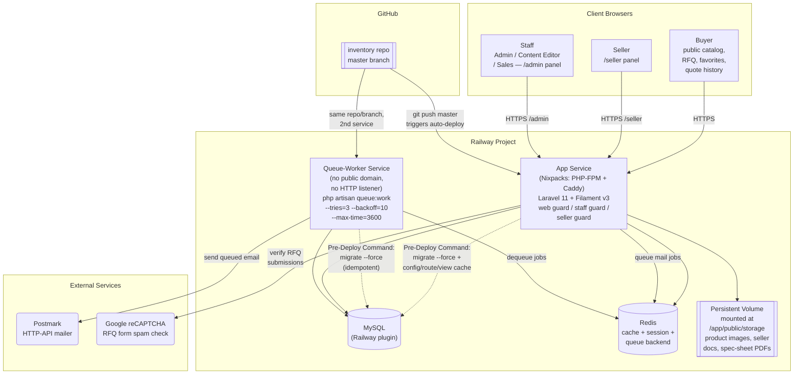
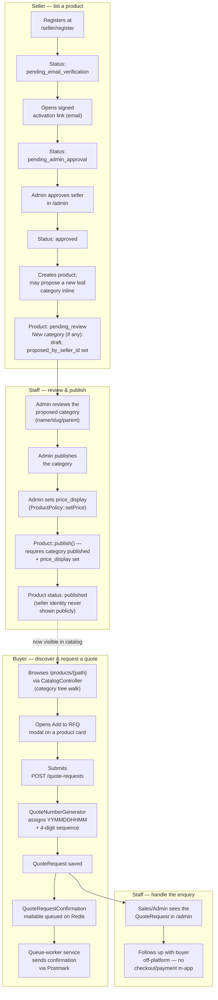

# Architecture & Process Flow

Diagrams reflect the system as deployed to PROD on Railway (see
`DEPLOYMENT.md`) and the core buyer/seller/staff workflows (see
`CLAUDE.md`). Regenerate/update these whenever the deployment topology or
the RFQ/product-review flow changes materially.

## 1. Production architecture

**Notes**

- Two Railway services run from the same repo/branch: the **app service**
  (handles HTTP traffic) and the **queue-worker service** (processes queued
  mail — RFQ confirmations, seller activation/approval/rejection,
  newsletter). Neither can substitute for the other; queued mail silently
  piles up in `failed_jobs`/the Redis queue if the worker isn't running.
- The Pre-Deploy Command (`railway/init-app.sh`) runs in a throwaway
  container before the traffic-serving container boots — this is why the
  `public` disk points straight at `public_path('storage')` instead of the
  usual `storage:link` symlink (a symlink made in the throwaway container
  never reaches the real one). See `DEPLOYMENT.md` for the full story.
- `SESSION_DRIVER`, `CACHE_STORE`, and `QUEUE_CONNECTION` all ride on the
  same Redis instance in production; local dev uses `sync`/`database`/`file`
  instead (no Redis needed day-to-day).
- Mail is currently blocked on Postmark being configured with a verified
  sender — see `docs/pending-items.md`.

## 2. Process flow — seller listing → staff review → buyer RFQ

**Notes**

- A product can never be marked `published` outside `Product::publish()` —
  that method is the single enforcement point for "category published +
  price set first."
- If the seller didn't propose a new category, `S8`'s category step is
  skipped and the product goes straight into the standard review queue
  against an already-published category.
- Buyer accounts (`web` guard) are optional — the RFQ flow above works for
  guests too; an account only adds `/favorites` and `/my-quote-requests`.
